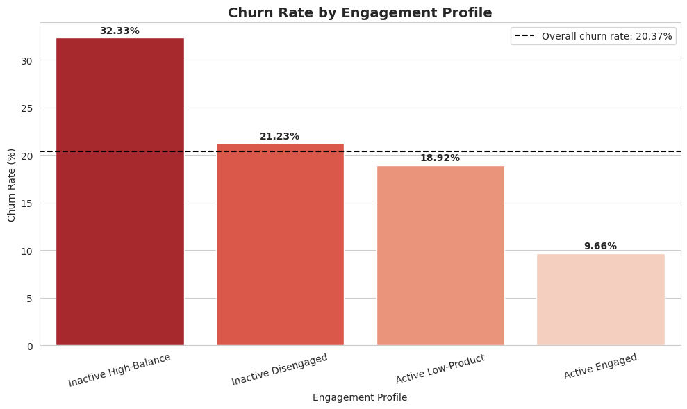
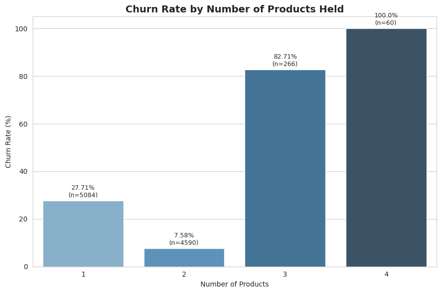
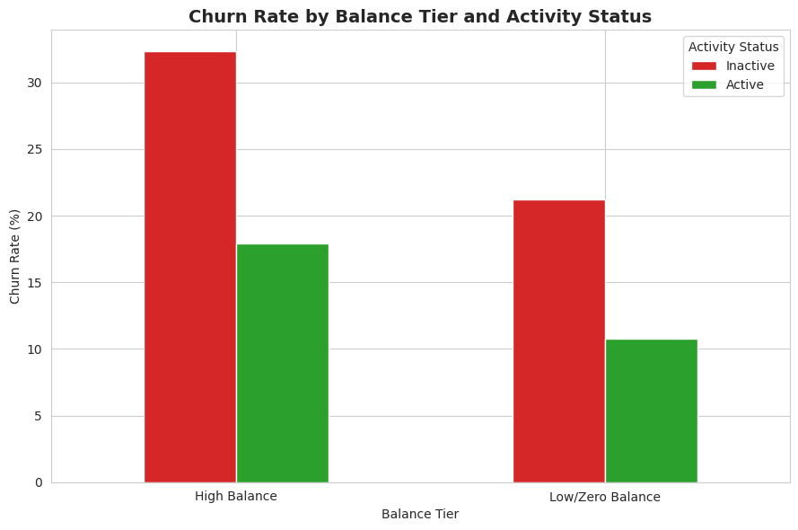
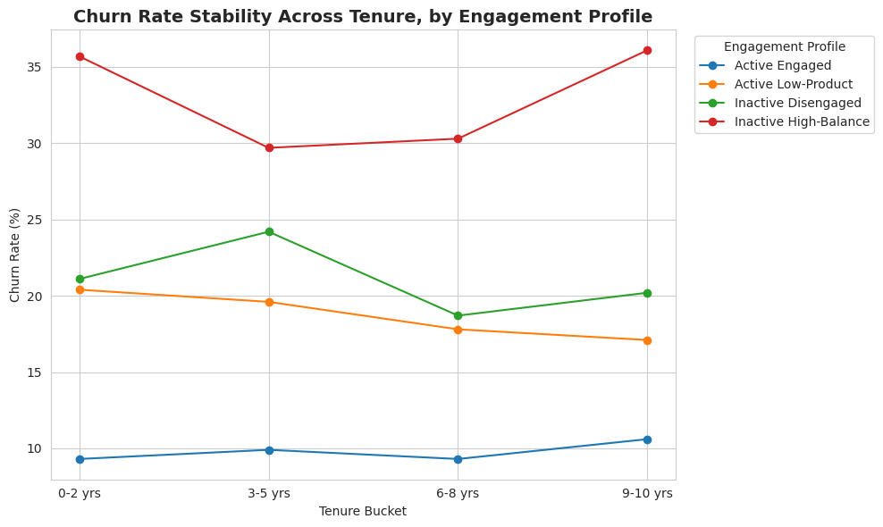
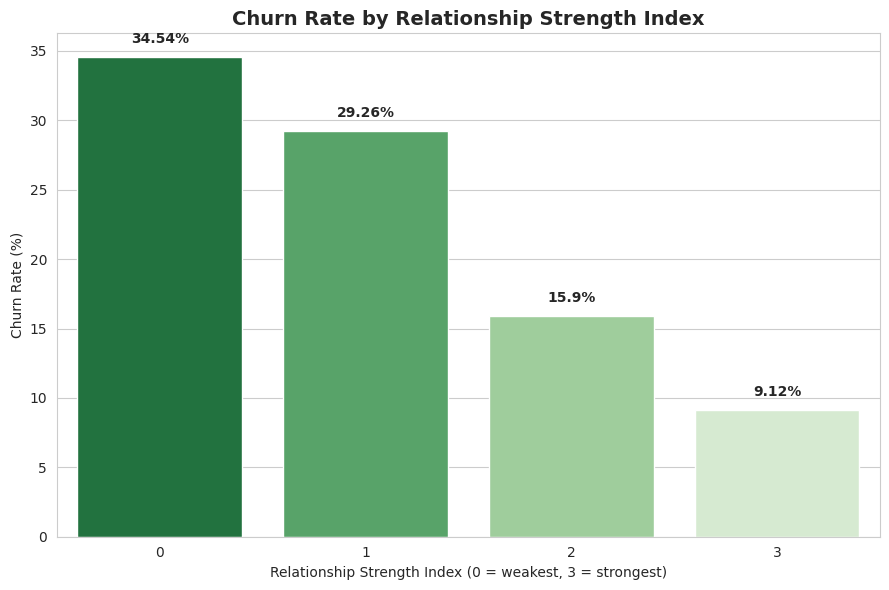

# Customer Engagement & Product Utilization Analytics for Retention Strategy

A behavioral analytics project analyzing 10,000 European bank customers to determine whether **engagement and product usage** predict churn better than **balance and demographics** alone.

> Unified Mentor Internship Project

**Live Dashboard:** _[link will be added here after deployment]_

---

## Table of Contents

- [Overview](#overview)
- [Problem Statement](#problem-statement)
- [Dataset](#dataset)
- [Repository Structure](#repository-structure)
- [Key Findings](#key-findings)
- [Key Performance Indicators](#key-performance-indicators)
- [How to Run the Notebook](#how-to-run-the-notebook)
- [How to Run the Dashboard Locally](#how-to-run-the-dashboard-locally)
- [Deliverables](#deliverables)
- [Tech Stack](#tech-stack)

---

## Overview

Banks have traditionally judged customer loyalty by financial standing: account balance, salary, credit score. This project tests a different idea: that **how a customer behaves** with the bank, how active they are and how many products they use, predicts churn far more reliably than how much money they have.

Using a dataset of 10,000 customers, this project builds:
- A full exploratory data analysis pipeline (Jupyter Notebook)
- Five custom Key Performance Indicators (KPIs) for engagement-based retention
- An interactive Streamlit dashboard for live exploration
- A formal research paper with recommendations

## Problem Statement

Despite having data on customer engagement and product usage, banks often lack quantitative insight into which behaviors drive retention, whether product depth reduces churn, and whether high balances alone ensure loyalty. This project answers those questions directly with data.

## Dataset

10,000 customer records, no missing values, no duplicates.

| Column | Description |
|---|---|
| CustomerId | Unique customer identifier |
| Surname | Customer surname |
| CreditScore | Customer creditworthiness |
| Geography | France, Spain, or Germany |
| Gender | Male / Female |
| Age | Customer age |
| Tenure | Years with the bank |
| Balance | Account balance |
| NumOfProducts | Number of bank products held (1-4) |
| HasCrCard | Credit card ownership (1/0) |
| IsActiveMember | Activity indicator (1/0) |
| EstimatedSalary | Estimated annual salary |
| Exited | Churn indicator — the target variable (1/0) |

## Repository Structure

```
customer-retention-analytics/
├── app.py                                  # Streamlit dashboard application
├── European_Bank.csv                       # Dataset
├── requirements.txt                        # Python dependencies
├── customer_retention_analysis.ipynb       # Full EDA + KPI notebook
├── README.md                               # This file
└── assets/                                 # Chart images used in this README
    ├── engagement_profile_churn.png
    ├── product_utilization_churn.png
    ├── balance_activity_churn.png
    ├── tenure_stability_churn.png
    └── relationship_strength_churn.png
```

## Key Findings

### 1. Engagement matters more than balance

Customers were classified into four engagement profiles based on activity status and product depth.



Inactive High-Balance customers churn at **32.33%**, more than three times the rate of Active Engaged customers (**9.66%**), even though they typically look financially healthier on paper.

### 2. Two products is the retention sweet spot, not four



Churn drops sharply from **27.71%** (1 product) to **7.58%** (2 products). Counter-intuitively, customers holding 3 or 4 products churn at **82.71%** and **100%** respectively, behaving as a distinct high-risk segment rather than showing deeper loyalty.

### 3. Activity status affects churn regardless of balance tier



Being inactive roughly **doubles** churn risk within both high-balance and low-balance groups. Nearly **half (49.12%)** of all above-median-balance customers are currently inactive, a large pool of quietly at-risk premium customers.

### 4. Engagement risk is stable regardless of tenure



Tenure alone barely affects churn (19-23% across all tenure bands). But each engagement profile's churn rate stays consistent across tenure, proving engagement is a stable, reliable predictor, not a fading effect.

### 5. A composite relationship score predicts churn cleanly



A combined score (active member + 2 or more products + credit card) shows a clean, monotonic drop in churn from **34.54%** (score 0) to **9.12%** (score 3).

## Key Performance Indicators

| KPI | Value | Interpretation |
|---|---|---|
| Engagement Retention Ratio | 1.88x | Inactive customers churn nearly twice as often as active customers |
| Product Depth Index | 72.64% | Moving from 1 to 2 products cuts churn risk by nearly three-quarters |
| High-Balance Disengagement Rate | 49.12% | Roughly half of above-median-balance customers are inactive |
| Credit Card Stickiness Score | 3.03% | Card ownership alone is a weak retention lever |
| Relationship Strength Index | 34.54% → 9.12% | Churn drops steadily as engagement signals accumulate |

## How to Run the Notebook

1. Clone this repository.
2. Install Jupyter and the required packages:
   ```
   pip install jupyter pandas numpy matplotlib seaborn
   ```
3. Launch Jupyter and open the notebook:
   ```
   jupyter notebook customer_retention_analysis.ipynb
   ```

## How to Run the Dashboard Locally

1. Clone this repository.
2. Install dependencies:
   ```
   pip install -r requirements.txt
   ```
3. Run the dashboard:
   ```
   streamlit run app.py
   ```
4. Open `http://localhost:8501` in your browser if it doesn't open automatically.

## Deliverables

- **Research Paper** — full EDA, insights, and recommendations (submitted as a separate Word document)
- **Streamlit Dashboard** — this repository, deployed live via Streamlit Community Cloud
- **Executive Summary** — a short, non-technical summary for government stakeholders (submitted as a separate document)

## Tech Stack

`Python` · `pandas` · `matplotlib` · `seaborn` · `Streamlit` · `Plotly` · `Jupyter`

---

*Prepared by Ankita Choudhary as part of the Unified Mentor Internship program.*
